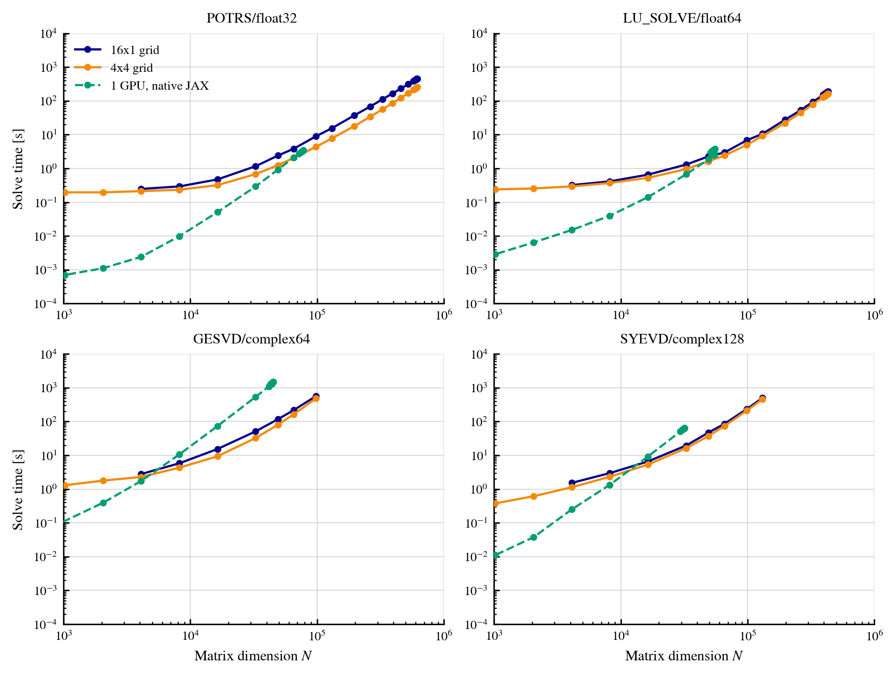
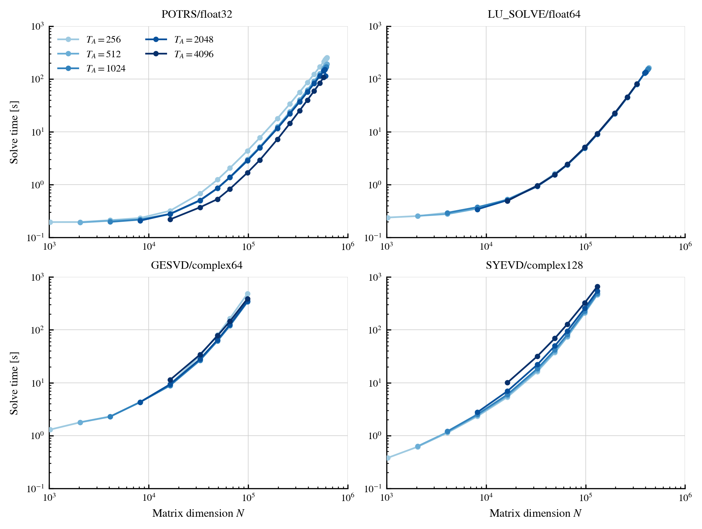

# Performance and scaling

This page presents the performance and scaling of JAXMg across multiple GPUs
and compute nodes. Performance in distributed matrix routines depends not only
on the available GPU resources, but also on how the calculation is divided
between them. We therefore examine the two principal configuration choices
available in JAXMg: the process-grid layout and the matrix tile dimension,
$T_A$.

The results provide practical guidance for configuring JAXMg, rather than
hardware-independent performance guarantees. Complete benchmark scripts and
results are available in the
[JAXMg benchmark repository](https://github.com/therooler/jaxmg_benchmark).

## Benchmark configuration

We consider four representative combinations of routine and data type:

- `potrs` with `float32`;
- `lu_solve` with `float64`;
- `gesvd` with `complex64`;
- `syevd` with `complex128`.

For `potrs`, `lu_solve`, and `syevd`, the input is the diagonal matrix
$A=\operatorname{diag}(1,\ldots,N)$. The two linear solves additionally use
$b=(1,\ldots,1)^\mathsf{T}$. For `gesvd`, the input is a random Gaussian
matrix with zero mean and unit variance.

Both configuration studies use 16 NVIDIA H100 SXM5 GPUs, each with 94 GB of
memory, across four nodes. Each node contains four GPUs connected by NVLink
and four 400 Gb/s InfiniBand links for inter-node communication.

## Process-grid layout

The first benchmark compares a one-dimensional $16\times1$ process grid with
a two-dimensional $4\times4$ grid at a fixed tile dimension $T_A=256$.

<figure markdown="span" class="benchmark-figure">
  [{ .benchmark-image }](../_static/benchmarks/process_grid_comparison.png)
  <figcaption markdown="span">
    Wall-clock runtime against matrix dimension $N$ on 16 NVIDIA H100 GPUs.
    The $16\times1$ grid is shown in dark blue, the $4\times4$ grid in orange,
    and native single-GPU JAX in dashed green. Curves for the $16\times1$ grid
    begin at larger $N$ because avoiding padding requires $N$ to be divisible
    by $16T_A$, compared with $4T_A$ for the $4\times4$ grid.
  </figcaption>
</figure>

Under the [2D block-cyclic
redistribution](../technical_details/memory_distribution.md#stage-3-2d-block-cyclic-redistribution),
moving from the $16\times1$ to the $4\times4$ grid introduces a second
inter-rank redistribution phase, but provides a more balanced distribution
during cuSOLVERMp execution. The process-grid layout therefore determines the
balance between redistribution overhead and distributed solver efficiency.

Across every routine, the solver-side benefit outweighs the additional
communication. Over matrix dimensions completed by both layouts, the
$4\times4$ grid achieves geometric-mean speed-ups of $1.77\times$ for
`potrs`, $1.23\times$ for `lu_solve`, $1.38\times$ for `gesvd`, and
$1.21\times$ for `syevd` relative to the $16\times1$ grid.

The smaller maximum matrix dimensions reached by `gesvd` and `syevd` reflect
the substantially larger cuSOLVERMp workspaces required by these
decompositions. At sufficiently large $N$, both distributed layouts also
outperform the corresponding native single-GPU JAX implementation. The
computational benefit of distributed execution therefore exceeds its
redistribution overhead before single-GPU memory becomes limiting.

## Tile dimension

Having established the performance advantage of the $4\times4$ process grid,
we next hold this layout fixed and vary $T_A$ from 256 to 4096.

<figure markdown="span" class="benchmark-figure">
  [{ .benchmark-image }](../_static/benchmarks/tile_size_comparison.png)
  <figcaption markdown="span">
    Effect of tile dimension on wall-clock runtime for a $4\times4$ process
    grid using the same 16 NVIDIA H100 GPUs. Curves are shaded from light to
    dark as $T_A$ increases through 256, 512, 1024, 2048, and 4096. Larger
    tiles begin at larger $N$ because each matrix dimension must contain a
    whole number of tiles along both process-grid axes.
  </figcaption>
</figure>

The response is strongly routine-dependent. Increasing $T_A$ reduces the
runtime of `potrs`, leaves `lu_solve` broadly unchanged, and increases the
runtime of `syevd`. The `gesvd` response is non-monotonic, with the shortest
runtime at the intermediate value $T_A=1024$ and slower execution for both
smaller and larger tiles. Tile selection should therefore be benchmarked for
the routine and matrix sizes of interest while also satisfying the
[no-padding condition](../examples/choose_tile_size.md#the-no-padding-condition).

## Large-scale execution

To demonstrate the larger scaling limit, we ran JAXMg on 64 NVIDIA H200 SXM5
GPUs, each with 143 GB of memory, across eight nodes. Each node contained eight
NVLink-connected GPUs and eight 400 Gb/s InfiniBand links.

Using an $8\times8$ process grid and $T_A=1024$, JAXMg completed a Cholesky
solve with $N=1{,}499{,}136$. The distributed matrix occupied 8.2 TiB in
aggregate, while each local shard and its redistribution scratch used 94.7%
of the available device memory. The warm solve completed in 654 seconds.

At $N=1{,}310{,}720$, the largest dimension completed by both tested layouts,
the $8\times8$ grid was $6.8\times$ faster than the $64\times1$ grid: 452
seconds compared with 3065 seconds. The balanced grid both reduces the
redistribution scratch required for a fixed tile dimension and distributes the
solver computation more evenly.
