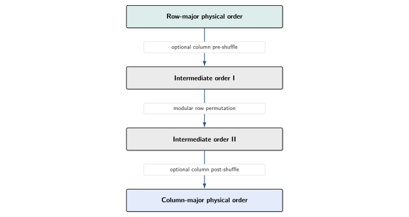
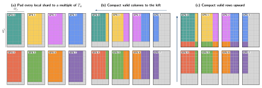
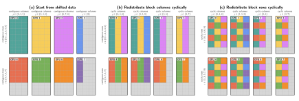

# Memory distribution

JAXMg accepts ordinary JAX arrays sharded over a one- or two-axis device mesh.
However, cuSOLVERMp expects each local matrix buffer to use column-major memory
and the global matrix to follow a 2D block-cyclic distribution. JAXMg bridges
these layouts inside one fused C++/CUDA FFI call.

The forward path used before a distributed solver is:

<figure markdown="span" class="memory-distribution-figure">
  [{ .memory-distribution-image }](../_static/flowcharts/ffi_to_cusolvermp.svg)
</figure>

The sections below describe the three forward redistribution stages. After a
matrix-valued solver output is produced, the stages are reversed to restore the
original JAX layout. Values-only `syevd` and `gesvd` return replicated vectors
directly and do not need reverse matrix redistribution.

## Memory bound

The native redistribution uses one scratch allocation per FFI call. Its size is
set by the largest tile slab moved during the final 2D block-cyclic stage.
For a matrix with local capacities $N_r \times N_c$ and solver tile dimensions
$T_r \times T_c$,

$$
S_{\mathrm{scratch}}
=
3\max\left(T_cN_r,\;T_rN_c\right)
$$

elements are required. For the square tiles used by the public solvers,
$T_r=T_c=T_A$. The factor of three is derived in
[Stage 3](#stage-3-2d-block-cyclic-redistribution).

Stages 1 and 2 reuse this allocation and process the largest batches that fit
within it. They do not allocate a second full local matrix. When more than one
matrix participates in a fused solver workflow, JAXMg allocates the maximum
scratch requirement across those matrices and reuses the same buffer.

## Layout terminology

Three different concepts are involved in the redistribution.

### Logical matrix

The logical matrix describes which value appears at each matrix coordinate.
Changing the physical memory order or the GPU that owns a value does not change
the logical matrix.

### Local memory layout

This is the physical order of elements within each GPU buffer:

```text
row-major:    consecutive elements belong to the same logical row
column-major: consecutive elements belong to the same logical column
```

JAX presents the local matrix shards in row-major order, whereas cuSOLVERMp
requires column-major local buffers.

### Process-grid mapping

This determines how communicator ranks are placed in the two-dimensional
cuSOLVERMp process grid. For a $2 \times 3$ grid, the supported row-major rank
map is

$$
\begin{bmatrix}
r_0 & r_1 & r_2 \\
r_3 & r_4 & r_5
\end{bmatrix},
\qquad
\mathrm{rank}=p_rP_c+p_c,
$$

while the supported column-major rank map is

$$
\begin{bmatrix}
r_0 & r_2 & r_4 \\
r_1 & r_3 & r_5
\end{bmatrix},
\qquad
\mathrm{rank}=p_cP_r+p_r.
$$

Here, $(p_r,p_c)$ is a process-grid coordinate and $(P_r,P_c)$ is the process
grid shape. JAXMg accepts these regular row-major and column-major mappings.
Arbitrary rank maps are rejected because cuSOLVERMp exposes these two standard
grid-mapping modes rather than a general rank-to-coordinate table.

## Stage 1: local layout conversion

The first stage reconciles the local physical memory layouts used by JAX and
cuSOLVERMp. The logical matrix is not transposed. For example,

$$
A=
\begin{bmatrix}
a_{00} & a_{01} & a_{02} \\
a_{10} & a_{11} & a_{12}
\end{bmatrix}
$$

has the following physical memory vectors:

$$
\begin{aligned}
\operatorname{row\_major}(A)
  &= [a_{00},a_{01},a_{02},a_{10},a_{11},a_{12}], \\
\operatorname{column\_major}(A)
  &= [a_{00},a_{10},a_{01},a_{11},a_{02},a_{12}].
\end{aligned}
$$

Asking XLA to materialize a column-major FFI input directly can require an
additional full-sized local matrix. JAXMg instead converts each donated buffer
in place using a parallel implementation of the rectangular permutation
decomposition introduced by Catanzaro, Keller, and Garland in
[*A Decomposition for In-place Matrix Transposition*](https://research.nvidia.com/sites/default/files/pubs/2014-02_A-Decomposition-for/ppopp2014.pdf).
The conversion consists of a modular row permutation surrounded, when required
by the local dimensions, by column pre- and post-shuffles:

<figure markdown="span" class="memory-distribution-figure">
  [{ .memory-distribution-image }](../_static/flowcharts/inplace_transpose.svg)
</figure>

The required shuffles are determined from the local row and column counts and
their greatest common divisor. Each kernel copies a batch of complete rows or
columns into scratch before writing the permuted values back. The shared scratch
size therefore controls the number of rows or columns processed in one launch.

### Parallelism

Layout conversion is entirely local. Every GPU processes its shard concurrently
on its XLA-provided CUDA stream, with no inter-rank communication. Within each
GPU, the kernels batch as many independent rows or columns as the shared scratch
allocation permits.

## Stage 2: top-left edge-padding alignment

If a local shard dimension is not divisible by the corresponding tile
dimension, JAXMg first pads that shard to provide enough capacity for the
cuSOLVERMp layout. This leaves padding between neighbouring shards in the global
process grid. A destination tile may consequently overlap both real entries and
padding, preventing Stage 3 from moving complete contiguous tile slabs.

The native backend therefore compacts the real matrix towards the global
top-left, consolidating padding on the global right and bottom edges.

<figure markdown="span" class="memory-distribution-figure">
  [{ .memory-distribution-image }](../_static/memory_distribution/block_cyclic_padding_alignment.svg)
  <figcaption>
    Edge-padding alignment over a 2 &times; 4 process grid. Colours identify
    the GPU that originally owned each entry; grey cells are padding. Column
    slabs first move left within each process row, then row slabs move upwards
    within each process column.
  </figcaption>
</figure>

The compaction is an open-chain permutation: padding provides empty
destinations, so the source data can be moved without preserving an additional
live slab. It proceeds in two passes:

1. **Horizontal pass:** shift valid column slabs left within each process row.
2. **Vertical pass:** shift valid row slabs upwards within each process column.

### Dependency waves

Within either pass, a movement can depend on a previous movement creating its
destination space. The schedule is therefore divided into ordered waves. Waves
execute sequentially, but every transfer in one wave is independent across the
orthogonal process-grid axis:

| Pass | Movement within | Concurrent across |
| --- | --- | --- |
| Horizontal | each process row | process rows |
| Vertical | each process column | process columns |

For example, one horizontal wave can move matching column slabs simultaneously
across all process rows. A later wave may then shift the remaining data locally
within each rank. The vertical pass applies the same scheduling rule across
process columns.

Unlike the closed cycles in Stage 3, edge-padding alignment can use the entire
shared scratch allocation as one temporary transfer buffer. Moves larger than
that allocation are divided into the largest contiguous rectangles that fit.
Cross-rank rectangles use the borrowed communicator, while overlapping
same-rank rectangles are packed into scratch before being written locally.

!!! warning "Padding temporarily requires an additional JAX allocation"

    The initial capacity padding must be performed by JAX because an existing
    donated allocation cannot be expanded once assigned. Both the original and
    padded arrays may therefore coexist temporarily. Choose a tile size that
    divides both local shard dimensions when possible; see
    [Choose a tile size](../examples/choose_tile_size.md).

## Stage 3: 2D block-cyclic redistribution

After edge-padding alignment, the global matrix is a regular array of complete
tiles. cuSOLVERMp distributes these tiles cyclically over both process-grid
axes. For a process grid with $P_r$ rows and $P_c$ columns, the tile at global
tile coordinate $(i,j)$ belongs to

$$
\operatorname{owner}(i,j)
=
\left(i\bmod P_r,\;j\bmod P_c\right).
$$

JAXMg constructs an explicit source-to-destination mapping for the complete
tile array and applies it in two separable phases:

1. **Column-owner phase:** complete tile-column slabs are permuted within each
   process row until every tile has the correct process-column owner.
2. **Row-owner phase:** complete tile-row slabs are then permuted within each
   process column until every tile has the correct process-row owner.

<figure markdown="span" class="memory-distribution-figure">
  [{ .memory-distribution-image }](../_static/memory_distribution/block_cyclic_redistribution.svg)
  <figcaption>
    Construction of the 2D block-cyclic layout over a 2 &times; 4 process
    grid. The aligned matrix is partitioned into complete tiles, tile-column
    slabs are distributed cyclically, and tile-row slabs are then distributed
    cyclically. Colours show each entry's original GPU ownership.
  </figcaption>
</figure>

The first phase can run independently across all process rows; the second can
run independently across all process columns. This separable construction moves
full-height or full-width tile slabs instead of transferring individual tiles.

### Permutation cycles

Within one process row or column, the source-to-destination mapping is a
bijection. JAXMg decomposes that mapping into disjoint closed permutation
cycles, skipping fixed points that already occupy their target slot. Each cycle
is applied in place by:

1. Saving one live slab;
2. Rotating the remaining slabs from the end of the cycle towards the vacated
   slot;
3. Restoring the saved slab into its final destination.

Dependent steps within a process-row or process-column group are serialized.
Matching steps from independent groups are assigned the same sequence number
and can participate in one communication round, provided their ranks do not
conflict. Larger process grids may require more rounds, but the amount of live
temporary data remains bounded.

### Slab movement and scratch size

Each cycle uses three scratch slots:

<figure markdown="span" class="memory-distribution-figure">
  [{ .memory-distribution-image }](../_static/flowcharts/send_recv.svg)
</figure>

A tile-column slab contains at most $T_cN_r$ elements, while a tile-row slab
contains at most $T_rN_c$ elements. The largest possible slab therefore has

$$
S_{\mathrm{slab}}=\max\left(T_cN_r,\;T_rN_c\right)
$$

elements. Providing one send, receive, and saved slot gives the fixed bound

$$
S_{\mathrm{scratch}}
=3S_{\mathrm{slab}}
=3\max\left(T_cN_r,\;T_rN_c\right).
$$

The movement schedule is fixed by the process grid, rank mapping, tile size,
and padded local shape. These values are static for a compiled JAX call, so the
same native schedule is reused on every execution.

## Communication and orchestration

JAXMg builds the native backend against the matching XLA source through Bazel.
This gives the FFI handler access to XLA's underlying NCCL communicator handle
(`ncclComm_t`). The same communicator is borrowed for the inter-rank
redistribution and passed to cuSOLVERMp for solver execution. Movements that
remain on one rank use local CUDA operations on the XLA-provided stream.

The forward redistribution, solver operation, and reverse redistribution
therefore share one communication context inside a single fused C++/CUDA FFI
call. JAXMg does not create a second independent communicator or return matrix
data to Python between stages.

## Reverse path

Matrix-valued solver outputs are produced in cuSOLVERMp's column-major,
2D block-cyclic layout. Before returning to JAX, the native call applies the
inverse block-cyclic cycles, reverses edge-padding alignment when needed, and
restores row-major local memory. Python then removes visible capacity padding.

For `potrs` and `lu_solve`, a vector solve input is represented internally as
an $N \times 1$ matrix. The public wrappers restore the original vector rank
before returning the result.

## Solver-specific native work

The redistribution stages are shared by every solver workflow. Their main
differences are the cuSOLVERMp call sequence and solver workspace:

- `potrs` calls `cusolverMpPotrf` followed by `cusolverMpPotrs`. If
  `return_logdet=True`, each process reads the Cholesky diagonal entries it owns
  and the rank-local sums are combined by an in-place NCCL all-reduce.
- `lu_solve` calls `cusolverMpGetrf` followed by `cusolverMpGetrs` and allocates
  a pivot vector according to the local cuSOLVERMp column ownership.
- `syevd` calls `cusolverMpSyevd`. Its eigenvector-producing mode materializes a
  full distributed eigenvector matrix and reverses the redistribution for that
  output. Its eigenvalues-only mode omits both operations.
- `gesvd` calls `cusolverMpGesvd` for rectangular matrices. U and Vh are
  selected independently in reduced or full form, and only requested vector
  matrices are allocated and reverse-redistributed. The shared scratch buffer
  is sized to the largest requirement among A and those outputs.

## Python and native responsibilities

Python is responsible for:

- validating dtypes, shapes, meshes, rank maps, and tile sizes;
- requiring one Python process per GPU for cuSOLVERMp execution;
- calculating and applying local capacity padding;
- constructing and caching the FFI wrapper.

Native C++/CUDA is responsible for:

- local row-major/column-major conversion;
- top-left edge-padding alignment;
- 2D block-cyclic redistribution;
- cuSOLVERMp handles, descriptors, workspace, and solver calls;
- reverse redistribution for matrix-valued outputs.

## Code map


| Stage 1: local layout conversion|
|--------|
|[src/cuda/memory_redist/layout_convert.cu.cc](https://github.com/flatironinstitute/jaxmg/tree/main/src/cuda/memory_redist/layout_convert.cu.cc)|

| Stage 2: edge-padding alignment |
|--------|
| [src/cuda/memory_redist/edge_padding_2d.cc](https://github.com/flatironinstitute/jaxmg/tree/main/src/cuda/memory_redist/edge_padding_2d.cc)|

| Stage 3: 2D block-cyclic redistribution| 
|--------|
|[src/cuda/memory_redist/block_cyclic_2d.cc](https://github.com/flatironinstitute/jaxmg/tree/main/src/cuda/memory_redist/block_cyclic_2d.cc)|
|[src/cuda/memory_redist/rectangle_pack.cc](https://github.com/flatironinstitute/jaxmg/tree/main/src/cuda/memory_redist/rectangle_pack.cc)|
|[src/cuda/memory_redist/scratch.cc](https://github.com/flatironinstitute/jaxmg/tree/main/src/cuda/memory_redist/scratch.cc)|

| Solver orchestration|
|--------|
|[src/cuda/cusolvermp_routines/cusolvermp_potrs.cc](https://github.com/flatironinstitute/jaxmg/tree/main/src/cuda/cusolvermp_routines/cusolvermp_potrs.cc) |
|[src/cuda/cusolvermp_routines/potrs_logdet.cu.cc](https://github.com/flatironinstitute/jaxmg/tree/main/src/cuda/cusolvermp_routines/potrs_logdet.cu.cc) |
|[src/cuda/cusolvermp_routines/cusolvermp_lu_solve.cc](https://github.com/flatironinstitute/jaxmg/tree/main/src/cuda/cusolvermp_routines/cusolvermp_lu_solve.cc) |
|[src/cuda/cusolvermp_routines/cusolvermp_syevd.cc](https://github.com/flatironinstitute/jaxmg/tree/main/src/cuda/cusolvermp_routines/cusolvermp_syevd.cc) |
|[src/cuda/cusolvermp_routines/cusolvermp_gesvd.cc](https://github.com/flatironinstitute/jaxmg/tree/main/src/cuda/cusolvermp_routines/cusolvermp_gesvd.cc) |
